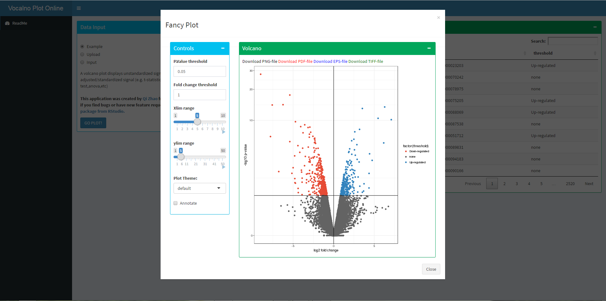

# volcanoP
an R package for simply plot volcano figures based on DE analysis result 


### Screen shot


### Install dependencies
To check the dependencies installed correctly, this command can help users to check the status of each installation<br/>
```R
library("Packages for check")
```
Code for install dependencies R packages 
```R
cDep <- c("ggplot2","shiny","shinyBS","shinydashboard","ggthemes","DT","dplyr","ggrepel")

###INSTALLED PACKAGES
#get installed list
inst <- packageStatus()$inst

#check and install DEPENDENCIES from CRAN
for(i in 1:length(cDep)){
  tag = which(inst$Package == cDep[i])
  if(length(tag)){
    remove.packages(cDep[i])
  }
  install.packages(cDep[i])
}

```
### Install TBploter
To install the latest development build directly from GitHub, run this:

```R
if (!require("devtools"))
  install.packages("devtools")
devtools::install_github("likelet/volcanoP")
```
### Update Information

### Designers:
Qi Zhao, zhaoqi3@mail2.sysu.edu.cn<br/>

### Developers:
Qi Zhao, zhaoqi3@mail2.sysu.edu.cn <br/>

### Maintainer:
Qi Zhao
Please feel free contact us. <br/>

### Copyright
MIT license

### Citation 
during preparation
